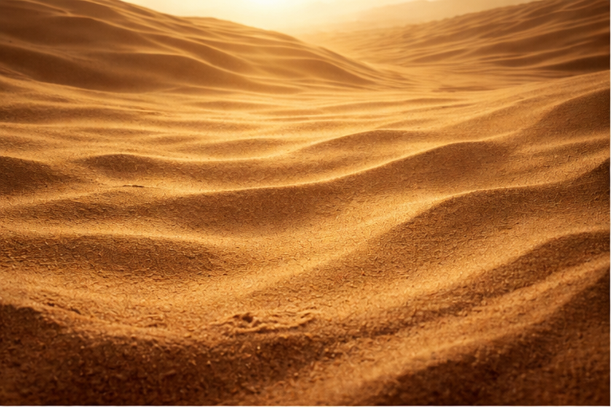
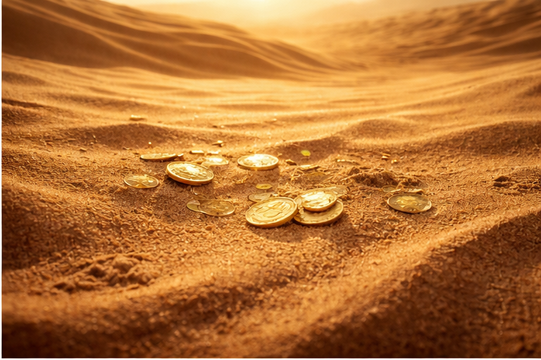
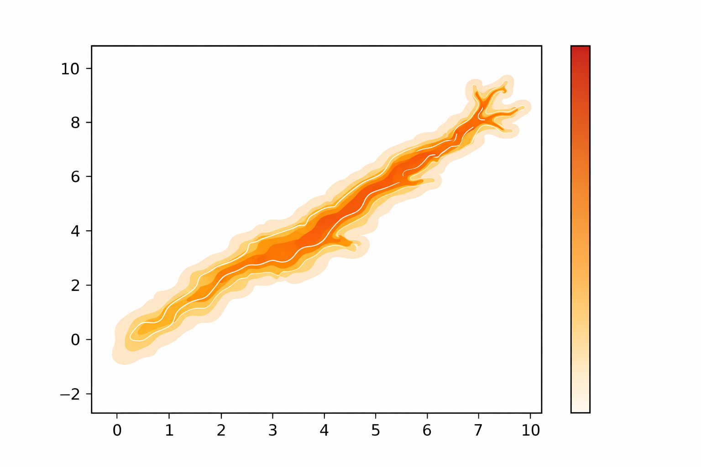
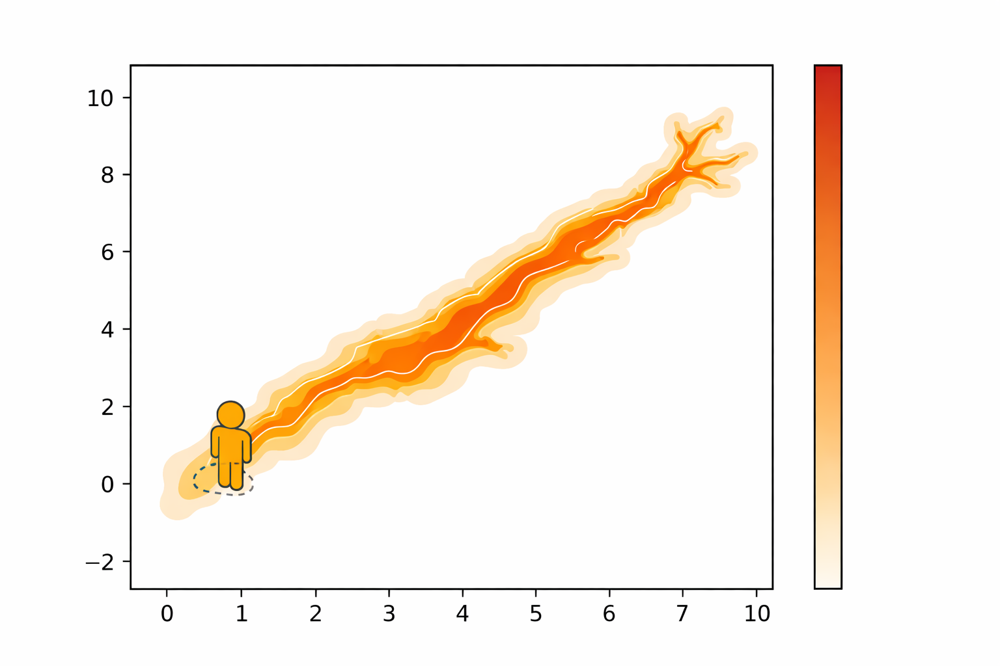
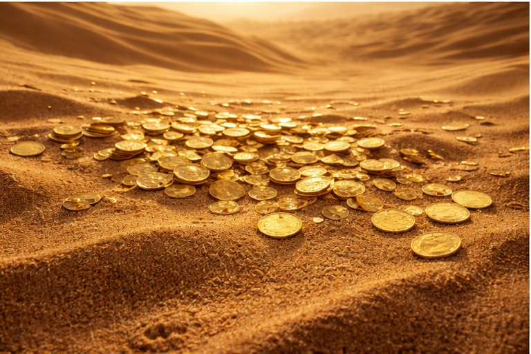
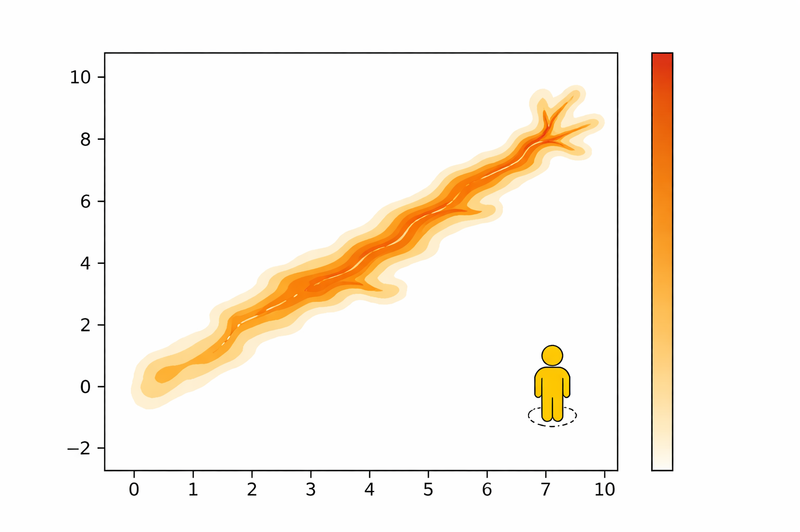
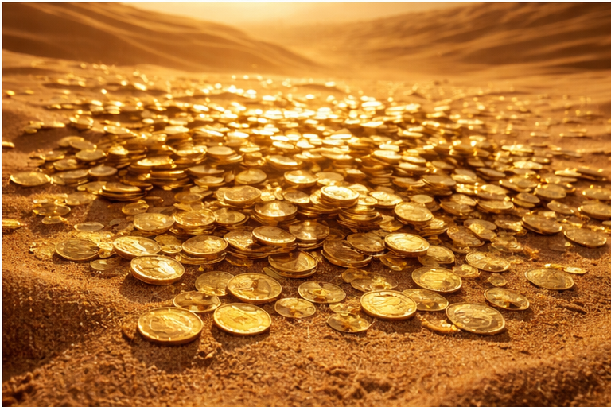

## The Scenario

:::: {.columns}

::: {.column width="40%"}
::: {.fragment}
**1. You are in a desert...**

{height="180px"}
:::

::: {.fragment}
**2. You find gold!**

{height="180px"}
:::
:::

::: {.column width="60%"}
::: {.fragment}
### The Goal: Map the Gold!
You own a gold mining company. You want to map the gold concentration over the entire area.

```{=html}
<div style="text-align: center;">
   
</div>
```
*(We want to uncover this map!)*
:::
:::

::::

## Strategy 1: Naive Random Sampling

:::: {.columns}

::: {.column width="55%"}
::: {.fragment}
Close your eyes, **land at a random spot**, and sample:

{height="120px"} $\rightarrow$ {height="120px"}
:::

::: {.fragment}
Then pick **another random spot**, land again:

{height="120px"} $\rightarrow$ {height="120px"}
:::
:::

::: {.column width="45%"}
::: {.fragment}
### Naive Monte Carlo
You keep randomly sampling uniform locations to build your map.

<ul style="font-size: 0.9em;">
   <li><strong style="color: green;">Pros:</strong> Completely unbiased. Super simple.</li>
   <li><strong style="color: red;">Cons:</strong> Spend 90% of your time digging in sand. Highly inefficient.</li>
</ul>

*We need a smarter way...*
:::
:::

::::

## Interactive: Naive Monte Carlo

```{=html}
<div class="sim-controls" style="display:flex; justify-content:center; gap:20px; margin-bottom: 10px;">
   <button id="naive-play" class="btn">Play / Pause</button>
   <button id="naive-reset" class="btn">Reset</button>
   <div id="naive-stats" style="font-size:1.2em; font-weight:bold; align-self:center;">Samples: 0</div>
</div>
```

:::: {.columns}

::: {.column width="50%"}
<h4 style="text-align:center; margin-bottom:5px;">True Target Density</h4>
```{=html}
<div style="display:flex; justify-content:center;">
   <canvas id="naive-true" width="450" height="450" style="max-width:100%; height:auto; border:2px solid #555; border-radius:8px;"></canvas>
</div>
```
:::

::: {.column width="50%"}
<h4 style="text-align:center; margin-bottom:5px;">Reconstructed Map</h4>
```{=html}
<div style="display:flex; justify-content:center;">
   <canvas id="naive-canvas" width="450" height="450" style="max-width:100%; height:auto; border:2px solid #555; border-radius:8px;"></canvas>
</div>

<script src="naive_mc.js"></script>
```
:::

::::

## Strategy 2: The Smart Walk

Instead of jumping completely randomly across the entire map, let's explore **locally**:

:::: {.columns style="margin-top: 30px; align-items: center;"}

::: {.column width="33%" style="text-align: center;"}
::: {.fragment fragment-index=1}
**Look Left**
<br>

<br>
*(More Gold!)*
:::
:::

::: {.column width="34%" style="text-align: center;"}
**You Are Here**
<br>

<br>
*(Current Spot)*
:::

::: {.column width="33%" style="text-align: center;"}
::: {.fragment fragment-index=2}
**Look Right**
<br>

<br>
*(Less Gold...)*
:::
:::

::::

::: {.fragment fragment-index=3 style="text-align: center;"}
### Which way do you go?
:::

::: {.fragment fragment-index=4 style="text-align: center;"}
**Left?** Step towards More Gold! ($\rightarrow$ **100% Accept!**)  
**Right?** Never step towards Less Gold? ($\rightarrow$ **Reject?**)
:::

---

## The Greedy Trap

If you **always** step towards "More Gold", you get stuck on small local hills!

:::: {.columns style="margin-top: 30px; align-items: center;"}

::: {.column width="50%" style="text-align: center;"}

:::

::: {.column width="50%" style="text-align: center;"}

:::

::::

<h3 style="text-align: center; color: red;">You may get stuck!</h3>

---

## The Metropolis Solution

**The Trick:** Walk to a "worse" spot with a chance proportional to how much worse it is: 

:::: {.columns style="margin-top: 30px; align-items: center;"}

::: {.column width="33%" style="text-align: center;"}
**Look Left**
<br>

<br>
**More Gold (\$180)**
<br>
<br>
$\rightarrow$ **100% Accept**
:::

::: {.column width="34%" style="text-align: center;"}
**You Are Here**
<br>

<br>
*Current Spot* **(\$100)**
<br><br>
<br>
:::

::: {.column width="33%" style="text-align: center;"}
**Look Right**
<br>

<br>
**Less Gold (\$20)**  
<br>
$\rightarrow$ **20% Accept**
:::

::::


## Interactive: Metropolis-Hastings

```{=html}
<div class="sim-controls" style="display:flex; justify-content:center; gap:15px; margin-bottom: 10px; align-items:center;">
   <button id="mh-play" class="btn">Play / Pause</button>
   <button id="mh-reset" class="btn">Reset</button>
   <div style="font-size:0.9em;">Step: <input type="range" id="mh-step" min="5" max="100" value="20" style="vertical-align:middle; width:80px;"></div>
   <div id="mh-stats" style="font-weight:bold; font-size:1.1em;">Samples: 0 | Acc: 0</div>
</div>
```

:::: {.columns}

::: {.column width="50%"}
<h4 style="text-align:center; margin-bottom:5px;">True Target Density</h4>
```{=html}
<div style="display:flex; justify-content:center;">
   <canvas id="mh-true" width="450" height="450" style="max-width:100%; height:auto; border:2px solid #555; border-radius:8px;"></canvas>
</div>
```
:::

::: {.column width="50%"}
<h4 style="text-align:center; margin-bottom:5px;">Metropolis Path</h4>
```{=html}
<div style="display:flex; justify-content:center;">
   <canvas id="mh-canvas" width="450" height="450" style="max-width:100%; height:auto; border:2px solid #555; border-radius:8px;"></canvas>
</div>

<script src="mh_mc.js"></script>
```
:::

::::
